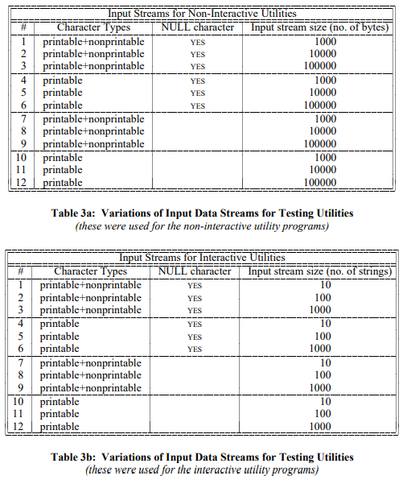

# Unix 유틸리티의 신뢰성에 대한 경험적 연구

- 원문: An Empirical Study of the Reliability of UNIX Utilities
- 본 문서는 fuzzing이 처음 언급된 논문

## 개요

커널과 유틸리티 프로그램들과 같은 OS의 기능들은 보통 신뢰할 수 있다고 가정한다. 우리의 최근 실험에 따르면, 테스트된 모든 유닉스 버전에서 25-33%의 충돌을 발생시킬수 있었다. 이 보고서는 이 실험에 대해설명하고 충돌들을 야기한 프로그램의 버그들을 분석한다.

## 내용

### 1. 소개

우리가 커널과 주요 유틸 프로그램들과 같은 기본적인 OS 기능들을 사용할때, 우리는 높은 신뢰성을 기대한다. 시스템의 이러한 점들은 자주 사용하게하고 프로그램이 올바르게 동작함을 의미한다. 프로그램의 정확성에 대해 체계적으로 진술하기 위해서는, 우리는 아마도 형식적인 검증의 어떤 형태를 사용해야 할 것이다. 프로그램 검증을 위한 기술은 발전하고 있지만, 아직 대형 시스템에 쉽게 적용되는 시점까지는 도달하지 못했다.

최근 경험으로 우리는, 운영체제 유틸리티의 완전한 세트의 형식적인 검증은 매우 성가신 작업이였지만, 더 완벽한 테스트의 형태가 필요했다. 이 작업은 어둡고 번개 치는 밤에 시작되었다. 저자 중 한명은 집에서 전화선으로 워크스테이션에 로그인했고 비가 전화선에 영향을 미쳤고; 거기엔 줄에 잘못된 문자가 빈번히 있었다.  그것은 그가 타이핑을 하게될때, 명령어에 잡음이 섞여 타이핑된것이였다. 이 잡음은 놀랍지 않았다. 우리가 놀랐던 것은 이러한 잘못된 문자로 인해 프로그램들이 중단되는 것이였다. 이 프로그램들은 기본적인 OS 유틸리티들이 포함되어있다. 이 프로그램들은 충돌이 발생이 안되야되는것이 타당하다; 정상적인 입력을 받게되면 최소한의 오류 메시지로 종료가 될 수는 있지만 충돌은 되면 안되는 것이다. 이 경험을 통해 우리는 정기적으로 사용하는 시스템에 심각한 버그가 숨어있을 수 있다고 생각하게 되었다.

이 시나리오는 여러 버전의 유닉스 운영체제에서 실행되는 유틸리티 프로그램의 체계적인 테스트를  하게되는 동기가 되었다. 프로젝트는 4단계로 진행되었다.

(1) 랜덤 문자열을 생성하는 프로그램과 대화형 유틸리티에서 테스트하는데 도움을 주는 프로그램 만들기

(2) 이 프로그램을 사용하여 많은 수의 유틸리티에 무작위 문자열을 입력하여 충돌이 일어나는지 테스트

(3) 프로그램을 충돌시키는 문자열을 식별

(4) 프로그램 충돌의 원인을 확인하고 이러한 충돌을 발생시키는 공통적인 실수를 분류

7가지 유닉스 버전에서 대략 90가지의 유틸리티 프로그램을 테스트 한 결과, 우리는 24% 이상의 충돌을 발생시킬수 있었다. 우리의 테스트에는 상용 제품 테스트를 거친 유닉스 버전도 포함되어있다. 이 프로젝트의 부산물은 충돌한 프로그램에 대한 버그 보고 목록과 시스템 커뮤니티에서 사용할수 있는 도구 모음을 제공한다.

여기에 프로그램 테스트 및 검증에 대한 풍부한 연구가 있다. 우리의 접근 방식은 테스트 절차를 대신하는게 아닌, 버그를 식별하고 전반적인 시스템 안정성을 높이는 비싸지 않은 메커니즘이다. 우리는 우리 연구에서 정확성에 대한 거친 개념을 사용하고 있다. 우리가 만든 프로그램은 단지 충돌 또는 무한루프에 빠진 것만 감지 한다. 우리의 목적은 기존의 테스트 절차를 보완하는 것이지 대체하는 것이 아니다.

이러한 유형의 연구는 몇가지 중요한 이유가 있다.

1. 이러한 버그들은 연구원이 보다 정교한 테스트 및 검증 전략을 평가 할 수 있는 테스트 케이스를 제공할 수 있기 때문이다.
2. 우리가 발견한 버그 중 하나는 인터넷 웜에 대한 보안 허점 중 하나를 제공했던 동일한 프로그래밍 실습에 의한 것이 였기 때문이다.
3. 몇몇 충돌은 부주의한 입력으로 인해 발생되기 때문이다.
4. 때때로 우연하게 프로그램에 잡음이 입력될 수 있기 때문이다.
5. 주요 유틸리티들이 현실에서 잡음있는 전화선으로 인해 충돌 나면 안되기 때문이다.
6. 우리는 랜덤 테스팅과 보다 전통적인 상용 소프트웨어 테스팅 사이의 상호작용에 흥미가 있기 때문이다.

우리의 테스팅 전략이 다소 소박해 보이지만, 치명적인 프로그램 버그를 발견하는 능력은 인상적이다. 만약 프로그램을 복합 유한 상태 기계가 된다고 생각한다면, 우리의 테스팅 전략은 정의되지 않은 상태를 검색하면서 상태 공간을 따라 무작위로 걷는것으로 생각할 수 있다. 네트워크 프로토콜 및 CPU 캐시 테스트와 같은 영역에서 유사한 기술이 사용되었다. 네트워크 프로토콜을 테스트 할때, 모듈은 데이터 스트림에 삽입 될 수 있다. 이 모듈은 프로토콜의 에러 감지와 복구 기능을 테스트 하기위해 패킷을 임의로 교란 시킨다. 무작위 테스팅은 다중 프로세서 캐시 일관성 프로토콜과 같은 복잡한 하드웨어를 평가할 때 사용되었다. 장치의 상태 공간이 메모리 구조와 결합되었을때는 충분히 커서 체계적인 테스트를 생성하기가 어렵다. 다중 프로세서 예제에서, 테스트 케이스를 무작위로 생성하면 상태 공간의 큰 부분을 커버하고 케이스의 생성을 간단히 하게한다.

이 논문의 과정은 다음과 같다.

섹션 2. fuzz, ptyjig 툴과 사용된 스크립트에 대한 설명

섹션 3. 테스트에 준 입력 타입에 대한 설명

섹션 4. 테스트로 얻은 결과

섹션 5. 우리가 발견한 버그에 대한 약간의 해설과 연구에 의해 탐지된 문제의 형식을 피하기 위한 제안을 포함하는 결론을 내리는 비고문

우리는 fuzz와 ptyjig를 위한 유저 매뉴얼을 부록에 포함한다.

### 2. 도구들

우리는 유틸리티들을 테스트하기 위한 기본적인 2가지의 프로그램을 개발했다. 첫번째는 fuzz라고 불리는 프로그램이다. 이 프로그램은 목표 프로그램에 의해 소비될 임의의 문자 스트림 생성한다. 테스트를 하기 위해 제어할 수 있는 다양한 옵션이 있다. 두번째는 ptyjig이다. 이 프로그램은 상호작용 유틸리티 프로그램을 테스트 하기위해 쓰여졌다. 상호작용 프로그램은 screen editor와 같이 표준 입력 파일이 터미널 장치의 특성을 가지기를 기대하는 것들을 말한다. 이 두 가지 프로그램 외에도, 우리는 수 많은 유틸리티의 테스트를 자동화 하기 위해 scripts를 사용한다.

#### 2.1 Fuzz: 무작위 입력 문자 생성

fuzz 프로그램은 기본적으로 임의의 문자를 생성한다. fuzz는 연속적인 문자열을 표준 출력 파일에 생산한다. 우리는 fuzz에 옵션을 주어 다른 유형의 테스트를 수행 할 수 있다. fuzz는 제어 문자와 출력가능한 문자 또는 이 그룹 중 하나를 NULL 문자와 함께 생성이 가능하다. 당신은 또한 각각의 문자 사이에 특정 지연을 줄수도있다. 이 옵션은 파이프를 통과하는 문자의 지연을 설명하고 사용자가 충돌을 일으키는 문자의 위치시키는데 도움을 준다. 다른 옵션은 특정 시드를 주거나 반복적인 테스트를 제공한다.

Fuzz는 파일에 출력 스트림을 기록하거나 표준 출력으로 출력할 수있다. 이 파일은 나중에도 시험할 수있게 해준다.  NEWLINE 문자를 임의로 출력 스트림에 삽입하고 출력 스트림의 길이를 제한하는 옵션이 있다. fuzz를 완벽히 이해하려면 부록의 사용자 매뉴얼을 참조하면 된다.

다음은 deqn 유틸리티를 테스트하는 명령이다.

​	fuzz 10000 -o outfile | deqn

거의 100,000 문자의 출력 스트림은 'outfile'에 기록될 것이다.

#### 2.2 Ptyjig: 상호작용 유틸리티 테스트

vi editor와 mail 프로그램 같은 입력 파일에 터미널 장치의 특성이 있어야하는 유틸리티 프로그램이 있다. 파이프를 통해 보내지는 fuzz의 표준 출력은 이러한 프로그램을 테스트하기에 충분하지 않다.

Ptyjig는 상호작용 유틸리티를 테스트 하기 위한 프로그램이다. 먼저 의사 터미널 파일을 할당한다. 이것은 두 부분의 장치 파일인데, 하나는 표준 터미널 장치 파일("/dev/ttyp?")과 다른 하나는 보내고 받는데 사용되어지는 터미널 파일("/dev/ptyp?")이다. 그런 후 가상 터미널 파일을 작성한 후, ptyjig는 지정된 유틸리티 프로그램을 시작한다. Ptyjig는 가상 터미널을 통해 입력으로 전송 된 문자를 유틸리티가 읽을 수 있도록 전달한다.

다은은 vi 유틸리티를 테스트하는 명령이다.

​	fuzz 10000 -o outfile | ptyjig vi

fuzz의 출력 스트림은 길이가 최대 100,000자이고 스트림은 파일 "output"에 기록된다. 완전한 설명은 부록의 매뉴얼을 참조하면 된다.

#### 2.3 scripts: 테스트 자동화

쉘 스크립트 파일은 테스트의 각 형태를 위해 쓰여졌다. 각각의 스크립트는 입력 특성의 모음을 모든 유틸리티에 실행하게한다. 스크립트는 각각의 유틸리티가 종료된 후에 "core" 파일의 존재를 확인한다. 코어 파일과 잘못된 입력 데이터 파일은 나중에 분석을 위해 저장된다.

### 3. 테스트

소프트웨어 도구를 만든 후, 우리는 이 도구를 사용하여 여러 버전의 유닉스 OS에서 실행되는 많은 유틸리티를 테스트했다. 각 유틸리티는 몇몇 다른 입력 스트림의 형태로 다른 시스템에 실행되어졌다. 유틸리트 프로그램의 테스트는 3가지의 결론을 생산할 수있다. 

(1) 충돌 - 비정상적으로 종료된 프로그램이 core file을 생성

(2) 행 - 프로그램이 무한반복되는 것처럼 보임

(3) 성공 - 프로그램이 정상적으로 종료

마지막 경우는 출력의 정확성을 지정하지 않았다.

현재까지, 우리는 7가지 버전의 유닉스를 가지고 테스트 했다. 이 버전들은 [표 1]에 요약되어있다. 대부분의 버전들은 4.2BSD 또는 4.3BSD의 형태로 부터 파생되었다. SunOS 릴리즈와 같은 일부 버전은 특히 커널 수준에서 상단한 개정을 거쳤다. SCO Xenix 버전은 AT&T의 Ssystem V 표준을 기반으로한다. 또한 IBM AIX 1.1 유닉스는 주로 기본 System V 유틸리티를 지원하는 테스트된 상품이다. 여러 하드웨어 아키텍쳐와 여러 시스템을 테스트하는 것은 중요하다. 한 시스템에서 오류가 있는 프로그램 명령문은 다른 곳에서도 충돌을 야기할 수있다. 이러한 유형의 문제로는 null 값 포인터를 통한 참조가 있다.

우리의 테스트는 7개의 버전 유닉스, 총 88개의 유틸리티 프로그램을 커버한다. 대부분의 유틸리티들은 각 시스템에서 테스트되었다. [표 2]는 각 시스템에서 테스트한 유틸리티의 이름이 있는 목록이다. 이 유틸리티들의 자세한 설명은 매뉴얼을 참조하면된다. 유틸리티의 목록은 일반적으로 사용되는 유틸리티를 포함한다, 예를 들면 메일 프로그램, 스크린 에디터, 컴파일러, 문서 문자 패키지. 목록은 또한 일반적이지 않은 C 언어 pretty-printer, cb등도 포함한다.

우리가 테스트 한 각 유틸리트 프로그램은 몇 가지 다른 유형의 입력 스트림을 받는다. 다른 유형의 입력은 우리가 테스트하는 유틸리티에 방아쇠를 당길수 있는 다양한 에러를 위해 의도된다. 테스트 데이터의 주요 변형은 NULL 바이트 및 입력 스트림의 최대 길이를 포함하여 출력할 수 없는 문자를 포함한다. 이 테스트들은 [표 3a]에 요약되어있다.

상호작용 유틸리티를 위한 입력 스트림은 약간 다른 특성을 가진다. 오버플로우를 피하기위한 입력은 128자의 길이의 행으로 분할 되었다. 입력 길이 파라미터는 줄 수로 설명되어 있으므로 100배로 축소 된다.

### 4. 분석과 결과

유닉스 유틸리티에 대한 우리의 테스트는 충돌하거나 hang걸리게 하는 놀라운 프로그램을 만들게했다. 이 섹션에서, 우리는 이 결과를 요약하고, 공통적인 프로그래밍 충돌을 야기하는 에러에 의한 결과를 그룹화하고 에러가 야기된 프로그래밍 사례를 보여준다. 측면 논평으로 우리는 테스트 도중 충돌하지 않은 많은 프로그램이 오류 메시지 없이 또는 해석하기 어려운 메시지로 종료되는 것을 알게되었다.

기본적인 테스트 결과는 [표 2]에 요약되어있다. 첫번째로 알아 두어야 할 것은 각 시스템에서 상당수의 유틸리티 프로그램을 중단 시키거나 중지 시킬수 있다는 것이다(24-33%). vi, emacs, csh, 문서 포맷팅을 위한 프로그램과 같은 목록에 포함된 프로그램들은 몇몇 공통적으로 사용되는 유틸리티이다. 우리는 충돌과  hanging과 같은 2가지 형태의 에러 결과를 감지했다. 프로그램이 core 파일을 생성하는 것을 중단하면, 프로그램이 중단된 것으로 간주되어 사용 가능한 입력이 있는 동안 출력을 생성하지 않고 계속 실행하면 중단 된 것으로 간주한다. 만약 프로그램이 입력이 중단 된 후에도 출력을 계속한다면 프로그램은 중단 된 것으로 간주한다. 중단된 프로그램은 중지된 상태가 감지되고 추가로 5분 동안 실행되도록 허용되도록 했다. 입력을 기다리는 것이 막혀있는 프로그램은 중지 된것으로 간주하지 않는다.

[표 4]는 충돌 또는 hang되어질 수있는 유틸리티 프로그램의 목록을 요약하고, 충돌의 원인으로 분류하고 어떤 시프템에서 프로그램이 중단되어 질수있는지 보여준다. 하나의 시스템에서 충돌한다해도 다른 시스템에서 충돌을 안할 수도있다. 이 결과는 몇가지 이유가 있기 때문이다. 첫번째 이유는 프로세서의 구조가 다르기 때문이다. 두번째 이유는 시스템마다 다른 버전의 유틸을 가지고 있기때문이다. 이런 차이는 유틸리티의 신뢰성을 향상 시키거나 저하시킬수있다. 유틸리티의 외부 구조 및 내부 구조가 모두 시스템에서 시스템으로 변경된다. 이것은 상업적으로 테스트 된 AIX 1.1 유닉스에서도 우리가 테스트 다른 유닉스 버전과 마찬가지로 취약하다는 것을 보여준다.

우리는 충돌의 이유를 그룹화했다. 포인터/배열 에러, 반환 코드를 체크하지 않는것, 서브-프로세스, 상호 작용 효과, 잘못된 오류 핸들러, 부호화된 문자열, 레이스 컨디션, 현재 미결정됨으로 분류한다. 각 범주에 대해 오류를 논의하고, 오류의 예로서 코드 조각을 표시하고, 오류의 의미를 제시하고, 문제에 대한 수정을 제안한다. 한 가지 예를 제외하고는 자동 테스트를 통해 모든 충돌 또는 hang이 발견되었다.

