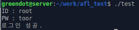
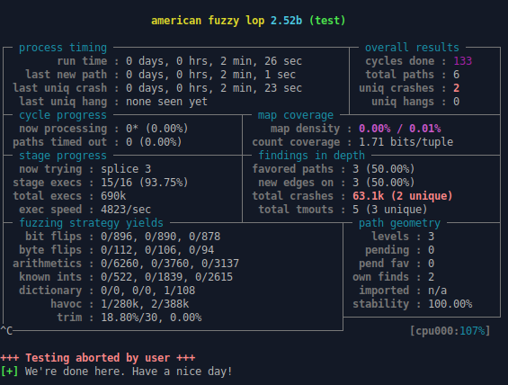
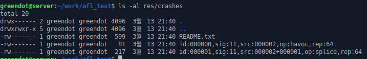

# AFL(American Fuzzing Lop)

화이트박스, 블랙박스 퍼징이 가능한 fuzzer

http://lcamtuf.coredump.cx/afl/

## 1. 지원 사항

- Linux, OpenBSD, FreeBSD, NetBSD 지원(Mac과 Solaris는 불안정)
- 32/64bit 지원
- 지원 언어: C, C++, Objective C
- 지원 컴파일러: C, C++, Objective C

## 2. 설치

``` bash
wget http://lcamtuf.coredump.cx/afl/releases/afl-latest.tgz
tar -xvf afl-latest.tgz 
cd afl-2.52b/
make all
sudo make install
afl-fuzz	# 프로그램 설치 확인
```

## 3. 명령

| 명령어      | 설명                             | 기본 사용법                                              |
| ----------- | -------------------------------- | -------------------------------------------------------- |
| afl-analyze | 파일 포맷 분석기                 | afl-analyze -i <test case file> target_app               |
| afl-clang   | clang wrapper                    | clang 명령어와 동일                                      |
| afl-clang++ | clang++ wrapper                  | clang++ 명령어와 동일                                    |
| afl-cmin    | 중복되는 테스트 케이스 제거      | afl-cmin -i <test case dir> -o <output dir> target_app   |
| afl-fuzz    | AFL의 코드 퍼징                  | afl-fuzz -i <test case dir> -o <output dir> target_app   |
| afl-g++     | g++ wrapper                      | g++명령어와 동일                                         |
| afl-gcc     | gcc wrapper                      | gcc 명령어와 동일                                        |
| afl-gotcpu  | CPU 선점 비율 출력               | afl-gotcpu                                               |
| afl-plot    | 진행률 출력- "gnuplot" 설치 필요 | afl-plot <afl state dir> <graph output dir>              |
| afl-tmin    | 테스트 케이스 최소화             | afl-tmin -i <test case file> -o <output file> target_app |
| afl-whatsup | 상태 점검 도구                   | afl-whatsup <afl_sync_dir>                               |

## 4. 실습

### 1. 실습 프로그램 생성

- 간단한 로그인 체크 프로그램

  ``` c
  /* test.c */
  #include <stdio.h>
  #include <string.h>
   
  int main(void){
      char id[16];
      char password[16];
   
      printf("ID : ");
      scanf("%s",id);
      printf("PW : ");
      scanf("%s",password);
  	// ID가 root 인지 비교, PW가 toor인지 비교
      if(strcmp(id,"root") == 0){
          if(strcmp(password,"toor") == 0){
              printf("로그인 성공.\n");
              return 0;
          }
      }
      printf("실패.\n");
      return 1;
  }
  ```

- 테스트 케이스 생성

  ```bash
  mkdir testcase
  cd testcase
  echo -e "a\toor" > test1.txt
  echo -e "root\na" > test2.txt
  echo -e "a\na" > test3.txt
  echo -e "root\toor" > test4.txt
  ```

### 2. 화이트 박스 테스트

기본 명령

``` bash
afl-fuzz -i <test case dir> -o <output dir> target_app
```

- afl-gcc로 컴파일

  ```bash
  cd ..
  afl-gcc -fno-stack-protector -o test test.c
  ```

- 실행

  ``` bash
  ./test
  ```

  

- afl-fuzz로 퍼징

  ```bash
  sudo -i
  echo core > /proc/sys/kernel/core_pattern
  exit
  mkdir res
  afl-fuzz -i testcase -o res ./test
  ```

  

- crash 확인

  uniq crashes 2개 발견

  해당 crash는 res 폴더에 저장

  ``` bash
  ls -al res/crashes
  ```

  

  - 충돌 1

    ``` bash
    ./test < res/crashes/id:000000,sig:11,src:000002,op:havoc,rep:64
    ```

    

  - 충돌 2

    ``` bash
    ./test < res/crashes/id:000001,sig:11,src:000002+000001,op:splice,rep:64
    ```

    

  - 파일 내용을 확인 하려면 hexdump 사용


### 3. 블랙 박스 테스트

이 테스트는 QEMU를 사용합니다.

기본 명령

``` bash
afl-fuzz -Q -i <test case dir> -o <output dir> target_app
```

- 테스트 전 요구 사항

  ``` bash
  sudo apt-get install libini-config-dev libtool-bin automake bison libglib2.0-dev qemu -y
  ```

- gcc를 통한 컴파일

  ``` bash
  gcc -fno-stack-protector -o test2 test.c
  ```

- afl-fuzz로 퍼징

  ``` bash
  afl-fuzz -Q -i testcase/ -o result/ ./test
  ```

  