# RabbitMQ guide in KR

## 1. RabbitMQ 설치

이 문서는 Ubuntu 18.04를 기준으로 작성하였습니다.

- rabbitmq-server 설치

  ```bash
  sudo apt-get install rabbitmq-server
  ```

- rabbitmq 관리 플러그인 설치

  - Rabbitmq-server 설치가 완료되면 플러그인도 활성화 시켜 놓는다. 
  - 플러그인 설치 후에는 RabbitMQ를 restart 해주어야 변경 사항이 반영됨

  ``` bash
  sudo rabbitmq-plugins enable rabbitmq_management
  sudo service rabbitmq-server restart
  ```

- rabbitmq 서비스 상태 확인

  ``` bash
  sudo service rabbitmq-server status
  ```

- 관리자 계정 추가

  - 처음 설치하였을 경우 기본적으로 guest 계정을 제공하기는 하지만 localhost에서만 접속을 허용함/ RabbitMQ를 설치하고 난 뒤 바로 Terminal에서 관리자 계정을 설정해주는 것이 좋음

``` bash
sudo rabbitmqctl add_user rabbitmq password
sudo rabbitmqctl set_user_tags rabbitmq administrator
```

- 관리 플러그인 접속

  - 관리자 설정까지 했을 경우, 관리 플러그인을 통해 RabbitMQ를 관리 가능

    

    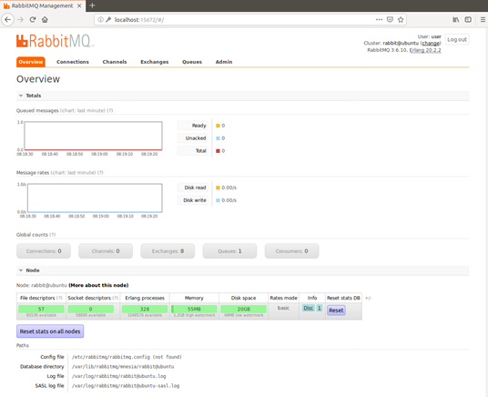


## 2. RabbitMQ 튜토리얼 실습

### 1. Hello world

> 원문: https://www.rabbitmq.com/tutorials/tutorial-one-python.html

가장 간단한 튜토리얼이다.

#### 실행

- send.py

  

  Send.py의 프로그램의 경우 큐에 단일 메시지를 보낸다. 4,5번째 줄의 경우 단일 메시지를 큐에 전송하기 위해 RabbitMQ 서버에 연결을 하기 위함이다. 현재 localhost로 연결을 하였기 때문에 로컬 머신에 있는 브로커로 연결이 되어 있다. 하지만 만약 특정 이름이나 IP 주소를 입력하면 로컬 머신이 아닌 외부 머신의 브로커로 연결이 가능하다.

  다음은 queue에 관한 줄로 7번째 줄은 메시지큐를 확인하는 것이다. 메시지를 큐로 보내려면 수신자 메시지큐가 있는지 확인을 해야한다. 존재하지 않은 위치로 메시지를 보내면 RabbitMQ는 메시지를 삭제한다. 8번째 줄은 메시지가 송신될 hello 큐를 만든 것이다.

  RabbitMQ 는 메시지를 queue로 직접 보낼수 없으면 항상 exchange 과정을 거쳐야한다. 우선 send.py에서는 특정한 exchange 방법이 아닌 기본 exchange 방법을 사용하고, routing_key 즉, 메시지 큐 식별자를 ‘hello’로 지정해주었다. 보낼 메시지는 ‘Hello World:’이다. 이것은 현재 코드 10~12번째 줄까지의 코드에 대한 설명이다.

- receive.py

  

  Receive.py 프로그램의 경우 큐로부터 메시지를 받고 스크린에 출력하는 프로그램이다. 이 경우 조차 메시지를 수신 받기 위해 RabbitMQ 서버에 연결을 해야 한다. send.py와 같이 receive 프로그램 또한 메시지 큐를 확인해야한다. 코드 8 번째 줄을 메시지 큐 식별자를 통해 연결을 하기 위함이다. 

  만약 현재 RabbitMQ에 있는 메시지 큐를 확인하고 싶거나 얼마나 많은 메시지들이 큐에 존재하는지 확인하기 위해서는 rabbitmqctl을 통해 확인이 가능하다. 

   ``` bash
  sudo rabbitmqctl list_queues
   ```

  메시지 큐로부터 메시지를 수신 받는 것은 송신하는 과정보다 복잡하다. 이 경우 callback() 함수를 메시지 큐에 작성함으로써 동작한다. 메시지를 받을 때 마다 이 callback() 함수는 Pika 라이브러리에 의해 호출된다. 호출되면 함수에 의해 수신 받은 메시지를 화면에 출력한다.

- 프로그램 실행 결과

  - 관리 플러그인 화면

  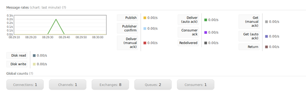

  터미널 & 플러그인화면이다. 메시지가 발생한 것을 볼 수있다.

### 2. Work queues

메시지 큐를 사용하는 주된 이유는 해야 할 일이 많을 경우, 새로운 작업에 대해 일을 즉시적으로 처리하는 것을 방지하기 위함이다(이전 작업이 완료될 때까지 기다린 후, 이전 작업이 끝나면 메시지 큐에 담겨져 있는 일을 수행하게 된다.). 리사이즈 할 이미지나 렌더링 할 PDF 파일 같은 실제 작업이 없으므로 time.sleep() 함수를 사용하여 이미 해야 할 일이 많은 것처럼 가장하여 작업 환경을 만드는 가정사항을 가진다. 

- worker.py

  

  이 파일은 위의 "1. Hello world"의 "receive.py"를 부분 수정한것이다.

  위의 코드를 통해 메시지를 처리하는 동안 [CTRL] + [C]를 사용하여 worker가 죽더라도 아무것도 손실하지 않게 된다. worker가 죽은 직후 모든 미확인 메시지가 재전송된다. 

- new_task.py

  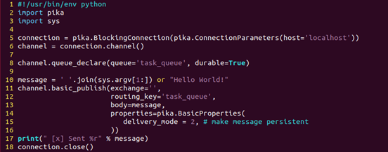

  이 파일은 위의 "1. Hello world"의 "send.py"를 수정한 것으로써, 명령어를 입력할 경우, 임의의 메시지를 보낼 수 있다. 이 프로그램의 경우 Work queue에 작업을 예약한다.

- 프로그램 실행 결과

    - 관리 플러그인 화면

    

    - new_task.py 실행 화면

    ​	

    - worker.py 실행 화면

    ​	


#### Round-robin dispatching

Task queue를 사용함으로써 작업을 쉽게 병렬 처리할 수 있다는 장점을 가지고 있다. 현재 해야 할 일이 많은 경우 더 많은 worker(work queue)를 추가할 수 있다. 이것은 쉽게 큐를 확장할 수 있다는 것이다.

기본적으로 RabbitMQ는 각 메시지를 순서대로 다음 consumer에게 보낸다. 평균적으로 모든 consumer는 동일한 수의 메시지를 수신하게 된다. 이 메시지 배포 방법을 라운드 라운드 로빈이라고 한다.

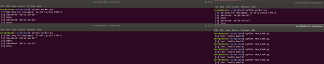

위의 캡쳐한 그림처럼 새로운 6번의 Task를 실행시켰고, 각각의 Consumer들이 2개씩의 메시지를 수신한 것을 알 수 있다.

#### Message acknowledgment

Consumer가 작업을 수행하는 데 몇 초가 걸릴 수 있다. Consumer중 한 명이 긴작업을 시작하고 부분적으로 만 수행되어 죽는 경우 RabbitMQ가 client에게 메시지를 전달하면 현재 코드로 삭제 즉시 표시가 된다. 이 경우 worker가 죽으면 처리중인 메시지가 손실된다. 이 특정 worker에게는 메시지가 발송되었지만 worker가 작업도중 죽는다면, 아직 처리되지 않은 메시지는 모두 소멸된다. 

이러한 상황에 대비하여(메시지를 잃지 않기 위해) RabbitMQ는 message acknowledgement를 제공한다. Ack는 특정 메시지가 수신되고 처리되었으며 RabbitMQ가 메시지를 삭제할 수 있다고 RabbitMQ에게 알리기 위해 Consumer가 보낸 답이다.

Ack를 전송하지 않고 Consumer가 죽거나(채널이 닫히거나 연결이 끊어 지거나 TCP 연결이 끊어지는 경우), RabbitMQ는 메시지가 완전히 처리되지 않았음을 인식하고 다시 대기한다. 동시에 다른 Consumer가 온라인 상태이면 다른 Consumer에게 신속하게 다시 전달한다. 그렇게하면 Worker가 사망하더라도 메시지를 잃어버리지 않게 된다. 메시지 timeout이 없다. RabbitMQ는 Consumer가 죽을 때 메시지를 재전송한다. 메시지 처리가 매우 오랜 시간이 걸리는 경우에도 괜찮다는 것을 의미한다. 

Manual message acknowledgement는 기본적으로 설정되어 있다. 위의 코드를 보면 no_ack = True 플래그를 통해 명시적으로 해제 시켰다. 이것은 작업을 마친 후에는 이 플래그를 제거하고 worker에게 적절한 확인을 보내는 것을 말한다. 

#### Message durability

RabbitMQ가 종료되거나 충돌하면 사용자가 알리지 않는 한 queue와 메시지를 잊어 버리게 된다. 메시지가 손실되지 않도록 하려면 queue와 메시지를 모두 명확하게 명시해놔야한다.  그렇게 하기 위해서는 다음과 같이 큐와 durable을 명시해주어야한다.

``` python
Channel.queue_declare(queue=’hello’, durable=Ture)
```

위의 코드 같은 경우 작동하지 않는데, 그 이유는 이미 ‘hello’라는 큐를 이미 정의했기 때문이다. RabbitMQ는 다른 매개 변수로 기존 queue를 재정의하는 것을 허용하지 않으며 이를 수행하려는 프로그램에 오류를 반환해준다. 이를 해결하기 위한 것으로 ‘hello’와 같이 명시되어 있는 queue를 선언해주는 것이 아닌 다른 이름을 가진 queue를 명시해주는 것이다.

``` python
Channel.queue_declare(queue=’task_queue’, durable=True)
```

위의 코드는 Publisher와 Consumer 코드에 둘다 명시를 해주어야 하는 조건이다.

Delivery_mode 속성에 값 2를 제공하여 메시지를 영구적으로 표시 가능

#### Fair dispatch

큐에서 메시지를 배포할 때 정확하게 배포를 하지 않는다. 파일이 균등하게 배포되지 않는 것을 방지하기 위해 basic.밴 메소드를 "prefetch_count=1" 설정과 함께 사용이 가능하다. 이것은 RabbitMQ에게 한번에 하나 이상의 메시지를 제공하지 말 것을 얘기하는 것이다. 이것은 현재 처리하고 있는 메시지가 처리될 때 까지 다음 메시지를 보내지 말하는 것을 의미한다.

### 3. Publish/Subscribe

#### Exchanges

이 부분에서는 Rabbit에서의 전체 메시지 모델을 소개

- 생성자는 메시지를 보내는 사용자 응용 프로그램
- Queue는 메시지를 저장하는 버퍼
- Consumer는 메시지를 받는 사용자 응용 프로그램

RabbitMQ의 메시지 모델의 핵심은 producer가 큐에 직접적으로 메시지를 보낼 수 없는 것이다. 이 때문에 사실 producer는 메시지가 어떤 queue에 전달되는지 전혀 알지 못한다. 대신 producer는 메시지를 exchange에만 보낼 수 있다. 하나의 exchange는 아주 간단한 일을 수행한다. 한쪽에서는 producer로부터 메시지를 받고 다른쪽에서는 메시지를 queue로 보낸다. Exchange는 받은 메시지를 어떻게 처리해야 하는지 정확히 알고 있다.(exchange 규칙에 의해 결정된다.)

사용할 수 있는 exchange 종류는 direct, topic, header 과 fanout이 있다. 밑의 emit_log.py의 8,9번째 줄을 확인해 보면 확인이 가능하다. 현재 exchange 유형이 fanout으로 나타나 있는 것을 확인할 수 있다. 이것은 수신한 모든 메시지를 알고 있는 모든 queue에 브로드캐스트한다. 이것은 log를 기록할 때 필수적이다.

#### Temporary queues

로그를 기록하는 경우

Rabbit에 사용자가 연결할 때마다 새로운 빈 queue가 필요하다. 이를 위해 사용자는 임의의 이름으로 queue를 생성할 수 있다. 아니면 서버가 임의의 queue를 선택하도록 할 수 있다. Queue 매개 변수를 queue_declare에 제공하지 않으면 이 작업이 가능하다.

#### Binding

Fanout exchange & queue를 만들었다면 exchange의 queue에 메시지를 보내라는 명령을 알려야한다. 이때의 exchange 와 queue의 관계를 binding이라고 한다.

```python
Channel.queue_bind(exchange=’logs’, queue=result.method.queue)
```

#### 실행

- emit_log.py

  

  로그 메시지를 보내는 producer 프로그램에서는 이름없는 메시지 대신 로그 exchange에 메시지를 게시하는 것이다. 전송할 때 routing_key를 제공해야하지만, fanout exchange의 경우 이 값은 무시된다. 

- receive_logs.py

  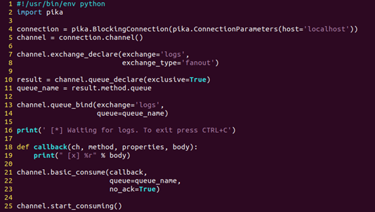


  연결을 설정한 후 exchage에 대해 선언을 하였다. Exchange에 queue가 없다면 메시지는 사라지겠지만, 상관없다. Consumer가 듣지 않는 경우에도 안전하게 메시지를 삭제 가능하다.

- 프로그램 실행 결과

  - 관리 플러그인 화면

  

  - emit_log.py 실행 결과

    

  - receive_logs.py 실행 결과

    

  python receive_logs.py > logs_from_rabbitmq.log를 통해 log 파일을 생성하고 위의 명령어를 통해 로그 파일에 작성이 된다.

### 4. Routing

#### Binding

Binding은 추가 routing_key 매개 변수를 사용할 수 있다. basic_publish 매개 변수와의 혼동을 피하기 위해 Binding_key라고 부른다. 다음 코드는 키로 Binding을 생성할 수 있는 방법이다.

``` python
channel.queue_bind(exchange=exchange_name, queue=queue_name, routing_key=’black’)
```

Binding_key의 의미는 exchange 유형에 의존한다는 것이다. 

#### Direct exchange

Publish/Describe 과정에서의 logging system에는 모든 메시지를 모든 사용자에게 브로드 캐스트하였다. 하지만 보내려는 메시지의 심각도에 따라 메시지를 필터링 할 수 있도록 확장하여야한다.(디스크에 로그 메시지를 쓰는  스크립트가 심각한 오류만 수신하고 경고 또는 정보 로그 메시지에 디스크 공간을 낭비하지 않도록 할 수 있음.)

Direct exchange를 사용하는 경우 메시지는 Binding 키가 메시지의 Routing key와 정확히 일치하는 queue로 이동한다.

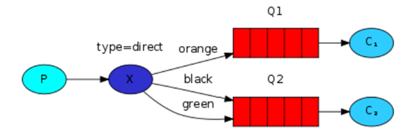

위의 그림을 보면 두개의 queue가 바인딩된 direct exchange 타입의 X를 확인할 수 있다. 첫번째 queue는 orange 바인딩 키로 바인딩되고 두번째 queue는 black, 다른하나는 green의 두개의 바인딩으로 이루어져 있다. 

이러한 설정에서 라우팅키가 orange인 exchange에 게시된 메시지는 queue Q1으로 라우팅된다. 

#### Multiple binding

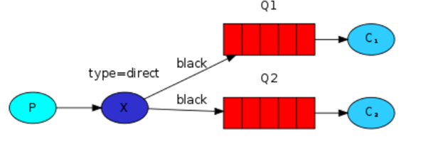

위의 그림과 같이 같은 바인딩키로 멀티플 바인딩하는 것이 가능하다. 위의 그림을 보면 black이라는 바인딩키로 두개의 queue를 바인딩하였다. 

#### 실행

- emit_log_direct.py

  

- receive_logs_direct.py

  

- 프로그램 실행 결과

  - 관리 플러그인 화면

  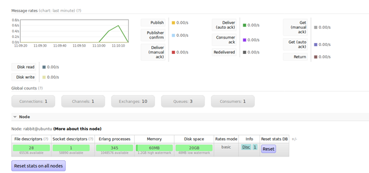

  - emit_log_direct.py 실행 화면

    

  - log 생성 확인 화면

    


### 5. Topics

#### Topic exchange

Topic exchange에 전송된 메시지에는 임의의 라우팅 키가 있을 수 없다. 이것은 점으로 구분된 단어 목록이어야 한다. 단어는 무엇이든 가능하지만 일반적으로 메시지에 연결된 일 부 기능을 지정한다. 몇가지 예를 보면, “stock.usd.nyse”, “nyse.vmw” 라우팅 키에는 원하는 만큼 많은 단어가 쓰일 수 있다.(최대 255바이트)

바인딩키는 항상 동일한 형태여야 한다. Topic exchange의 논리는 직접 라우팅과 유사하다. 특정 라우팅 키와 함께 전송된 메시지는 일치하는 바인딩 키로 바인드 된 모든 queue에 전달된다. 그러나 바인딩 키에는 중요한 두 가지 경우가 있다.

- ‘*’는 한 단어를 대신 할 수 있다.

- ‘#’는  0 또는 그 이상의 단어를 대체가 가능하다.

  

#### 실행

- Emit_log_topic.py

  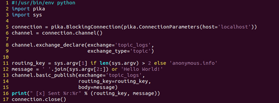

- Receive_logs_topic.py

  

- 프로그램 실행 결과

  - 관리 플러그인 화면

    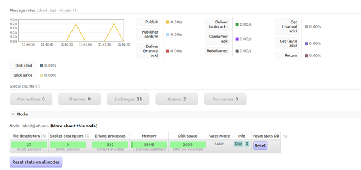


### 6. RPC

#### client interface

RPC 서비스를 사용하기 위해 클라이언트 클래스를 만든다. RPC 요청을 보내고 응답이 수신될 때까지 차단하는 call이라는 메서드를 노출한다.

```python
Fibonacci_rpc = FibonacciRpcClient()
result = Fibonacci_rpc.call(4)
printf(“fib(4) is %r” %result)
```

#### 실행

- rpc_server.py

  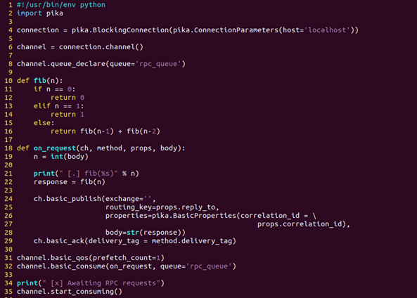

- rpc_client.py

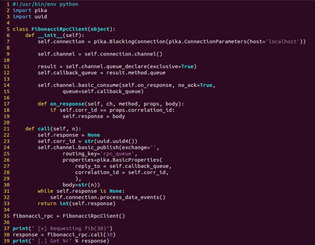

- 프로그램 실행 결과

  - 관리 플러그인 화면

    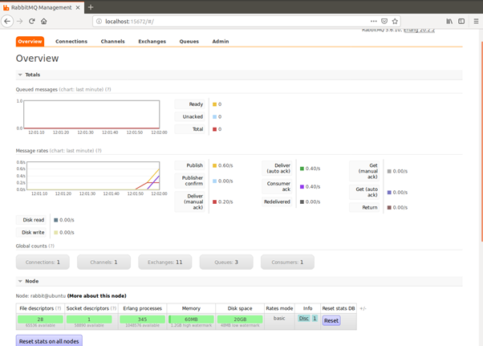

  - rpc_server.py 실행 화면

    

  - rpc_client.py 실행 화면

    