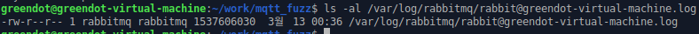

# RabbitMQ 취약점

## Management plugin의 Client ID 출력 문제로 인한 계정 노출

### 1. 취약점 발견

취약점 발견을 위해 메시지 퍼징을 시도하던 중 RabbitMQ management plugin에서 비정상적인 동작을 확인하게 되었음.

mqtt_fuzz는 mqtt 컨트롤 패킷을 퍼징된 패킷을 전송하는 퍼저이다. 해당 퍼저를 producer로 사용하여 RabbitMQ에 전달하였고 일정 시간이 흐른뒤 management plugin을 통해 큐의 정보를 확인하는 QUEUE 탭 접근을 시도하게 되면, 반응 하지 않는것을 확인함. 해당 문제를 확인하기 위해 `/var/log/rabbitmq/ ` 아래에 있는 로그에 접근하여 확인하던 중 "=ERROR REPORT===="가 기록된 것을 확인함.

> 
>
> 해당 로그 섹션 부분 하단 부분에 계정 정보가 노출됨

해당 에러 정보는 계정 정보(ID, Tag, PW)를 노출하는 것을 확인할 수 있음. 해당 계정은 management UI에 접근 가능한 관리자 계정을 나타냄. 해당 로그 폴더와 파일은 others에게 읽기 권한이 설정 되어있어, Rabbitmq가 설치된 서버에 다른 계정 사용자가 접근이 가능함을 알 수 있음.

> 
>
> 644 권한으로 설정되어 있는 것을 확인 가능

이 취약점은 RabbitMQ Management UI plugin에서 mqtt 프로토콜을 사용하는 패킷에서의 ClientID가 ASCII가 아닌 문자가 포함된 경우 Management plugin에서 값을 가져올때 ERROR가 발생됨.

해당 취약점은 `rabbitmqadmin -q list queues name` 명령을 사용하여 큐정보를 가져오려해도 동등하게 로그가 기록되나 이 경우는 guest에 대한 계정 정보가 출력됨.

해당 문제가 발생하고 정상적으로 동작하게 하려면 RabbitMQ를 초기화하여 큐를 init 해야 함을 확인

> RabbitMQ를 초기화 하는 커맨드
>
> ```bash
> sudo rabbitmqctl stop_app
> sudo rabbitmqctl reset
> sudo rabbitmqctl start_app
> ```

이 취약점은 RabbitMQ 3.6 version에서 확인했으며, 2019/03/30 현재 우분투 18.04 LTS에서  `sudo apt install rabbitmq-server` 명령을 통해 설치하는 경우 3.6 버전이 설치된다.

### 2. 취약점 관련 정보

해당 취약점은 ASCII가 아닌 문자열 출력으로 인해 발생되는 문제

### 3. 시나리오

2가지의 시나리오는 server에 일반 계정 접근이 가능한 상황으로 가정한다. 해당 계정은 rabbitmqctl을 사용 할 수 없음. 또한 rabbitmq-server의 서비스 관리 권한이 없음.

> user: user1
>
> pw: 1234

공격 스크립트는 다음과 같다.


#### 1. 로컬

mqtt_fuzz를 Rabbitmq-server가 설치된 서버에서 exploit하는 시나리오. 센서를 통해 데이터를 수집하는 상황

#### 2. 외부

mqtt_fuzz를 producer 위치에서 exploit하는 시나리오. A와 B가 채팅을 하는 상황에서 exploit 시도

